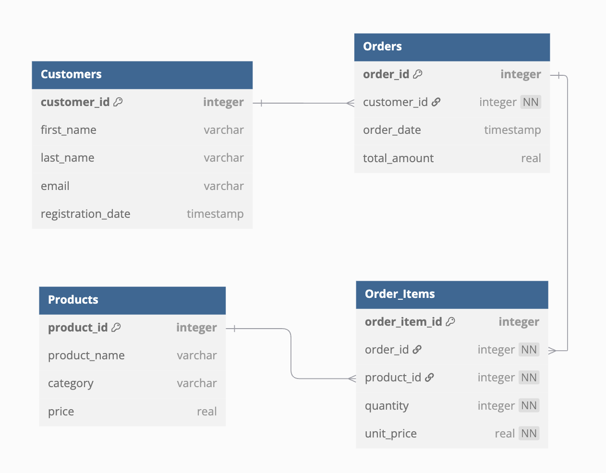

# Legal Desk Student Data-Scientist
This is a small task applicants will be asked to perform as part of the screening process. 

This is a task that simulates what a clasical task could be for a student data-scientist/analyst when working at Legal Desk. We have created some synthetic sample data which could mimic how our interal data-structures look. 

### Image of ER-Diagram

## Objectives
Please ensure that you with this dashboard display the following: 
- Abillity to work with multiple tables and some basic sql skills
- Your ability to work with data in python, wrangle some data with pandas
- Abillity to select proper visualizations for different purposes objectives
- And at last creativity is alsways valued :) 
